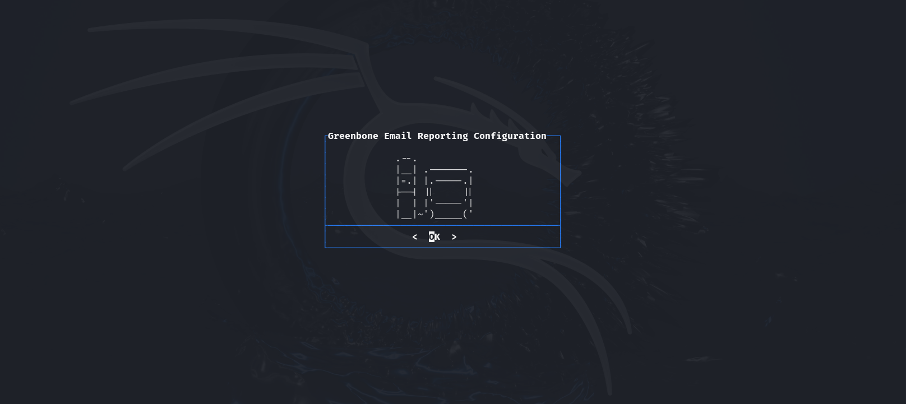
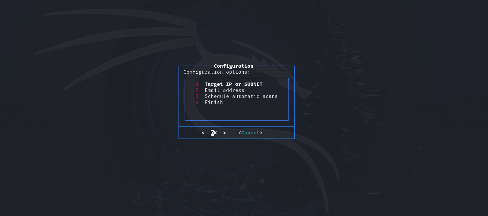
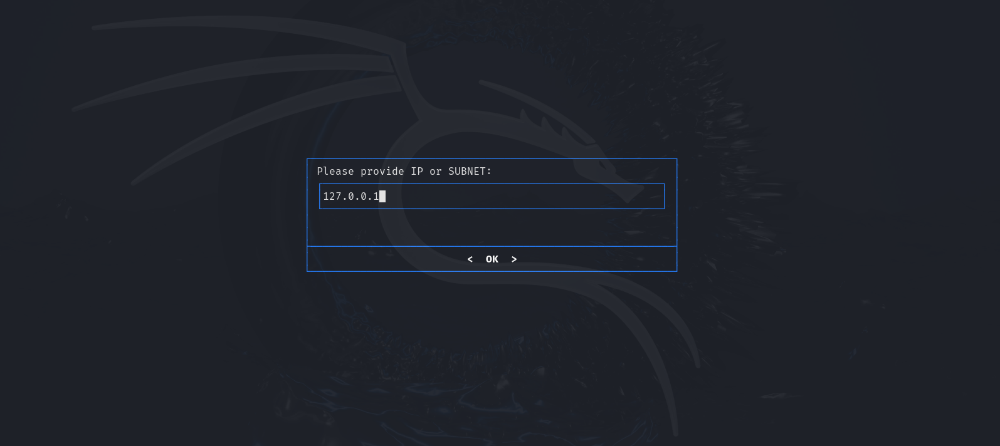
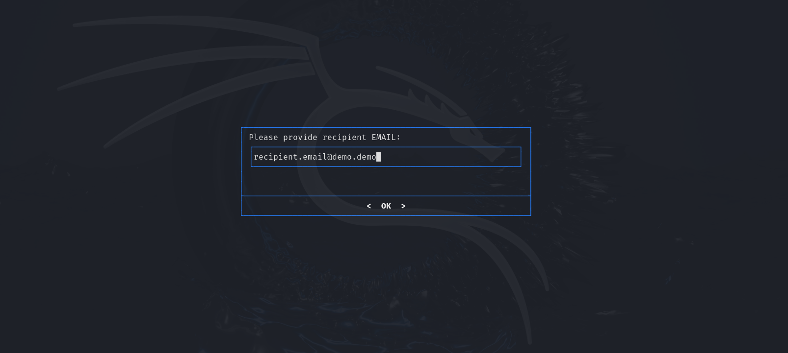
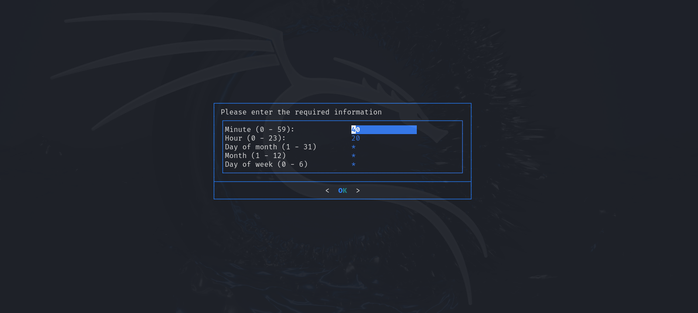

# Demostration of functionalities
The following screenshosts presents how application (Setup_Script.sh) looks.

|                      |
|:-------------------------------------------:| 
|               *Welcome menu*                |
|                         |
|                 *Main menu*                 |
|                       |
|  *Target IP or Subnet configuration menu*   |
|                        |
|    *Recipient email configuration menu*     |
|                     |
| *Scheduling information configuration menu* |
